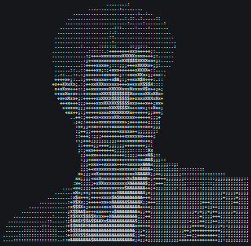
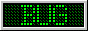
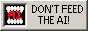

<table>
<tr>
<td valign="top" width="50%">

</td>
<td valign="top" width="50%">
<h3>🛠️ building weird stuff on the internet, one commit at a time</h3>
 
<!-- row 1 (1) -->

<!-- row 2 (2) -->

<!-- row 3 (3) -->

<!-- row 4 (4) -->

<!-- row 5 (4) -->

 
</td>
</tr>
</table>

